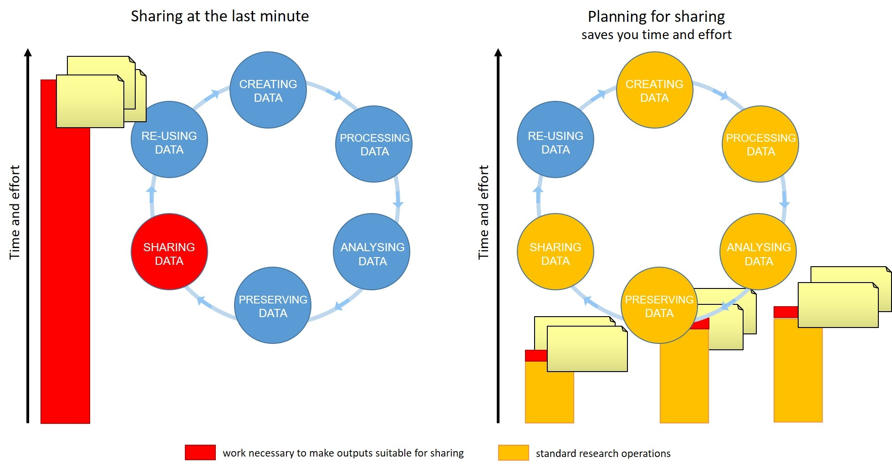

## Introductions

(3 minutes)
> Introductions set the stage for learning.
>
> --- Tracy Teal, Former Executive Director, The Carpentries
{: .testimonial}

Hello everyone, and welcome to the **FAIR for leaders** workshop.
We are very pleased to have you with us.

> ## Today's Trainers
>
> To begin the class, each Trainer should give a brief introduction of themselves.
>
{: .discussion}

### Online workshop specifics

> ## Our learning tools
>
> Before we begin let's explain how to use the tools:
> * Raising hands
> * Yes/No sticker
> * Chatroom for links not for jokes
> * Breakout rooms, leaving and rejoining
> * using pad, answering questions in pad
> * where to find things
> If needed, check the pre workshop setup, ask to report problems
> and help at a break or after the session.
>
{: .discussion}

Now we would like to get to learn something about you.

> ## Who are you and what are your expectations from the workshop (4.5 min)
>
> Please, Introduce yourselves telling each other why you have joined this course.
> Then, try to find one professional/academic thing that your group has in common. 
> For example:
> - we all had our latest grant proposals accepted by MRC
> - we are all desperately searching for an experienced lab technician
>
{: .challenge}

> ## You and data sharing (3min)
>
> Thinking of how you and your group make data or code available to others and how your group uses others’ data, write “+1” next to any statements that match your own experience:
> 
> - We do not really share data, we only publish the results as part of a publication:
> - We have made our data available only as Supporting Information for a paper:
> - We have made our data available as both Supporting Information and as a dataset in a repository:
> - We have made our data/code available without having it published in a paper:
> - We share the code in GitHub or another code repository:
> - We make the code available on demand:
> - We have used a dataset from a public repository:
>
{: .challenge}

( 7 min teaching )

## Better research by better sharing

For many of us, data management or output sharing in general
are considered a burden rather than a useful activity. Part of the problem
is our bad timing and lack of planning.

We will demonstrate to you:
- why you should know about Open Science, FAIR and good data management practices
- how adoption of those practices benefits yourself and your group/organization by:
-- improving productivity
-- speeding up inductions
-- helping with your managerial responsibilities

## Evolution of research and Open Science

Academic research works best by exchanging ideas and building on them. This idea underpins the Open Research movement, of which Open Science is a part. The aim is to make science more reproducible, transparent and accessible by making knowledge and data freely available. Open Science improves research by contributing to sharing of data and information and thereby leading to better-informed formulation of research questions and better-informed experimental design. In the long-run, and even in the short-term, this should lead to better, faster, more successful science. As science becomes more open, the way we conduct and communicate science changes continuously. 

Digital technologies, especially the internet, have accelerated the diffusion of knowledge and made it possible to make research findings and data available and accessible to the whole of society:
 * publications 
 * data 
 * physical samples
 * software 

*After [Gema Bueno de la Fuente](https://www.fosteropenscience.eu/content/what-open-science-introduction)*

### Open Science Building Blocks

* **Open Access:** Research outputs hosted in a way that make them accessible for everyone. Traditionally Open Access
  referred to journal articles, but now includes books, chapters or images.

* **Open Data:** Data freely and readily available to access (ie free of charge), reuse, and share (ie openly licensed). Smaller data sets were often made available as
  supplemental materials by journals alongside articles themselves.
  However, research data should be hosted in repositories (eg Zenodo, Edinburgh DataShare) where they can be given their own persistent identifier (eg DOI) to make them easily citable, and for greater findability, long-term accessibility. Sharing of data is facilitated by open licences such as Creative Commons licences, which make clear to the user what they can do with the data and what conditions apply. Trustworthy repositories assure long-term preservation and accessibility of data. 

* **Open Software:** Software where the source code is made readily available;
  and others are free to use, change, and
  share. Some examples of open-source software include the coding language R and its supporting software RStudio,
  as well as the image analysis software Fiji/ImageJ.

* **Open Notebooks:** Lab & notebooks hosted online, readily accessible to all. These are popular among some of the
  large funding bodies and allow anyone to comment on any stage of the experimental record.

* **Open Peer Review:** A system where peer review reports are published alongside the body of work. This can include
  reviewers' reports, correspondence between parties involved, rebuttals, editorial decisions etc...
  
* **Citizen Science:** Citizen participation in various stages of the research process, from project funding to collecting and analysing data. In other words, Citizen Science is when lay people become involved in scientific research, most commonly in data collection or image analysis. Platforms such as [zooniverse.org](https://www.zooniverse.org/) help connect projects with lay people interested in playing an active role in research, which  can help generate and/or process data which would otherwise be unachievable by one single person.

* **Scientific social networks:** Networks of researchers, which often meet locally in teams, but are also connected online, foster open discussions on scientific issues. Online, many people commonly use traditional social media platforms for this, such as Twitter, Instagram, various sub-reddits, discussion channels on Slack/Discord etc..., although there are also more dedicated spaces such as [researchgate.net](https://www.researchgate.net/).

* **Open Educational Resources (OER):** Educational materials that are free of charge for anyone to access and use to learn from, and openly licensed to remove barriers to re-use. These can be anything from talks, instructional videos, and explanations posted on video hosting websites (e.g. YouTube), to entire digital textbooks written and then published freely online. 

> ## Exercise 3: Why we are not doing Open Science / Data Sharing already (3 + 2 min)
>
> Discuss Open Science / Data Sharing barriers - what are some of the reasons for not already being open?:
>
>> ## Solution
>> - sensitive data (eg anonymising data from administrative health records can be difficult)
>> - IP
>> - I don't know where to deposit my data
>> - misuse (fake news)
>> - lack of confidence (the fear of critics)
>> - lack of expertise
>> - the costs in £ and in time
>> - novelty of data
>> - it is not mandatory
>> - I don't see value in it
>> - lack of credit (eg publishing negative results is of little benefit to you)
>>
> {: .solution}
{: .challenge}

(teaching 3min)
**Data management is a continuous process**

*Figure credits: Tomasz Zielinski and Andrés Romanowski*

Writing a Data Management Plan well can help you to share your data efficiently by identifying the stages of the research data lifecycle where you should document your data, describe your variables, capture your protocols, compile metadata, select suitable file formats. Doing this work while your research is taking place will make it far less time-consuming and more accurate. A stitch in time saves nine! 

When should you engage in data sharing and open practices?
* Data management should be done throughout the duration of your project.
* If you wait till the end, it will take a massive effort on your side and will be more of a burden than a benefit.
* Taking the time to do effective data management will help you understand your data better and make it easier to find when you need it (for example when you need to write a manuscript!).
* All the practices that enable others to access and use your outcomes directly benefit you and your group. 

In this workshop we will show you how you can plan and do your research in a way that makes your outputs readily available for re-use by others.

## Why you should know it - power figures

> ## Exercise 4. Your presence and influence (5 with Ex5)
> 
> Consider some of the ways you exert academic influence by your presence and your activity in the academic community. Which of the following reflect your own experience? 
> - I currently supervise at least 2 postdocs
> - I have promoted at least 3 PhDs
> - I revise at least 4 articles a year
> - I have been a member of a grant panel
> - I have been a member of a school/college/university committee
> - I have contributed to development of an institutional/community policy
> - I have been involved in the selection process for fellows / lecturers / readers
> - I am a member of a Research Council
> - Any other activities through which you exert academic influence in the research community?
> 
{: .challenge}

=======
> ## Exercise 5. Your minions(!) 
> Think about your research group. Have they done or been involved in any of the following Open Science activities? 
> * releasing software; 
> * making data available under an open licence; 
> * public engagement activities; 
> * participating in scientific community groups (eg journal club, Carpentries, ReproducibiliTea)
>
{: .challenge}

(teaching 8)
As power figures, you all have the power to bring about a better research culture by inspiring and supporting your teams to do Open Science, and leading by example through your own actions. 

## Research assessment
To change the way we do science we need to change the way we measure success, and change our incentives.   

### San Francisco Declaration On Research Assessment (DORA) 

Thousands of organisations around the world have signed DORA, including funders such as the Wellcome Trust, BBSRC and over two hundred other UK organisations. The declaration sets out a commitment to assessing research outputs based on their quality ('intrinsic merit'). While DORA famously calls for a reduced reliance on journal-based metrics it doesn't just cover papers, it applies to data too.  

https://sfdora.org 

The Wellcome Trust guidance on implementing DORA states that Wellcome requires institutions it funds to "commit to assessing research outputs and other research contributions based on their intrinsic merit". They distil the principles of DORA as follows: 

> "We believe that research assessment processes used by research organisations and funders in making recruitment, promotion and funding decisions should embody two core principles (‘the principles’) as set out in the San Francisco Declaration on Research Assessment (DORA):  
> 
> * **be explicit about the criteria used to evaluate scientific productivity**, and clearly highlight that the scientific content of a paper is more important than publication metrics or the identity of the journal in which it is published
>
> * **recognise the value of all relevant research outputs (for example publications, datasets and software)**, as well as other types of contributions, such as training early-career researchers and influencing policy and practice." 
> --- Wellcome Trust "Guidance for research organisations on how to implement responsible and fair approaches for research assessment" https://wellcome.org/grant-funding/guidance/open-access-guidance/research-organisations-how-implement-responsible-and-fair-approaches-research  

{: .testimonial}

Funders like Cancer Research UK and Wellcome have updated their application processes to include not just papers but more broadly-defined achievements, public engagement and mentoring. 

### Narrative CVs 

What is a narrative CV, and how does it relate to making data FAIR? 

"...a CV format in an application that prompts written descriptions of contributions and achievements that reflect a broad range of skills and experiences. This is a change from metrics-based CVs that are primarily  publication lists with employment and education history with little context."
Imperial College London

There is a growing recognition of the benefit of 'narrative CVs' to shifting the culture towards Open Science, even among the research funding establishment, for example see this UKRI event trailer ["Supporting the community adoption of R4R-like narrative CVs"](https://www.ukri.org/what-we-offer/supporting-healthy-research-and-innovation-culture/research-and-innovation-culture/supporting-the-community-adoption-of-r4r-like-narrative-cvs/) . 

### Prepare for FAIR, because it is easier to be well-prepared than to fake it! 

It takes time to produce open outputs, but the rewards come in time saved down the line, and greater quality and findability of data in the long-run. 

The quality of open outputs is easy to assess. 

Timestamps on the digital systems that are now used for sharing data, code etc will show very clearly how long you've been doing FAIR :-) 

## Why you should do it

> ## Exercise 6. Lottery winner (5)
> Imagine a situation in which you suddenly lose a postdoc because she/he has won the National Lottery and won’t be coming to work any more (or more realistically, they were hit by a bus). Which of the following scenarios can you relate to? 
> - everything should be recorded in their notebook, which you hope is in the office.  
But frankly, you have never checked how good their lab notes are. 
> - everything should be in the team’s Electronic Lab Notebook, and you can quickly check if that is the case. 
> - all data, excel, presentations and paper drafts are in a shared network drive. 
> - some data and documents may only be in the postdoc’s PC/laptop. 
> - every now and then, you check people’s data and notes, so you are fairly confident they follow good practices and you know where you can find what is needed. 
> - your group has a “data management” policy/plan to which all members are introduced as part of their induction, so at least in principle all should be fine. 
> - you have left it to your group to organise such trivial matters and you’re hoping they did it well. 
> - your lab manager should know it all. 
> - there was the old postdoc who knew it all but they left last year. 
> - you are getting nervous!!!

{: .challenge}

## Conclusion
Good research data management, FAIR data, Open Science are an integral part of scientific leadership in the modern world. 

## Agenda

Our agenda:
* We will talk about FAIR principles, which steps you should take
so that your "shared" outputs are of value.
* We will show you how Open Science related tools like ELN, code repositories etc benefit you as a team leader
* We will show you how public repositories make your outputs accessible and reusable.
* We will consolidate our knowledge of FAIR ready data management and data management planning.

> ## Attribution
> Content of this episode was adopted from: 
> * Wiki [Open Science](https://en.wikipedia.org/wiki/Open_science)
> * [European Open Science Cloud](https://www.eosc-hub.eu/open-science-info)
> * [Science is necessarily collaborative - The Biochemist article](https://portlandpress.com/biochemist/article/42/3/58/225220/Science-is-necessarily-collaborative).
> * UKRI [Supporting the community adoption of R4R-like narrative CVs](https://www.ukri.org/what-we-offer/supporting-healthy-research-and-innovation-culture/research-and-innovation-culture/supporting-the-community-adoption-of-r4r-like-narrative-cvs/) 
> * Imperial Colleage [Narrative CVs](https://www.imperial.ac.uk/research-and-innovation/support-for-staff/scholarly-communication/bibliometrics/narrative-cvs/ )
> * Wellcome [Guidance for research organisations on how to implement responsible and fair approaches for research assessment](https://wellcome.org/grant-funding/guidance/open-access-guidance/research-organisations-how-implement-responsible-and-fair-approaches-research)
>
{: .callout}

----------- template bits to remove ------------
## I am a section

With a text.

*After [Figure source](https://www.figure.link/)*

> ## I am a yellow info
>
> And my text.
{: .callout}

~~~
I am code
~~~
{: .source}

> ## I am a problem
>
> Defined here.
>
>> ## Solution
>>
>> *   I am an answer.
>> *   So am I.
> {: .solution}
{: .challenge}


