Tools for organizing and sharing scientific data can be also be helpful when
managing resources and peoples.

Have a look some of the features of GitHub a version control system and Benchling an electronic
lab notebook.

## GitHub

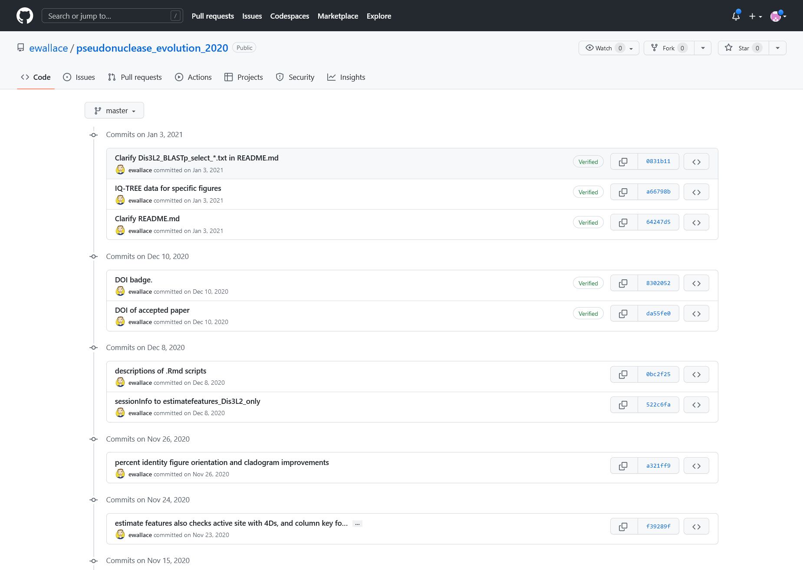

*ChangeLog, screen presenting list of changes made to the project (with author and dates)*

----
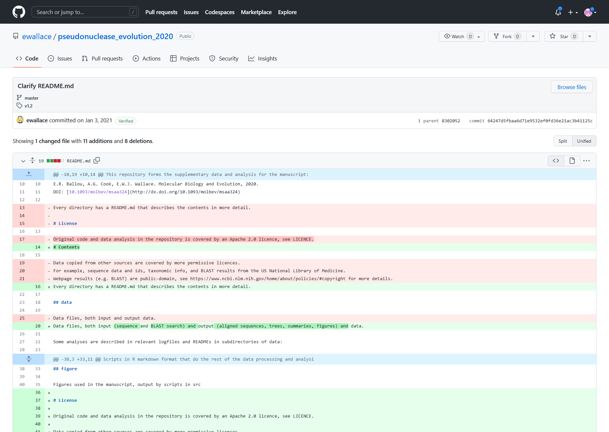

*Change Entry details. Showing the description message, affected file and the nature of change marked in colors.  
The red with '-' are sections which have been removed and the green with '+' are new content.*

----
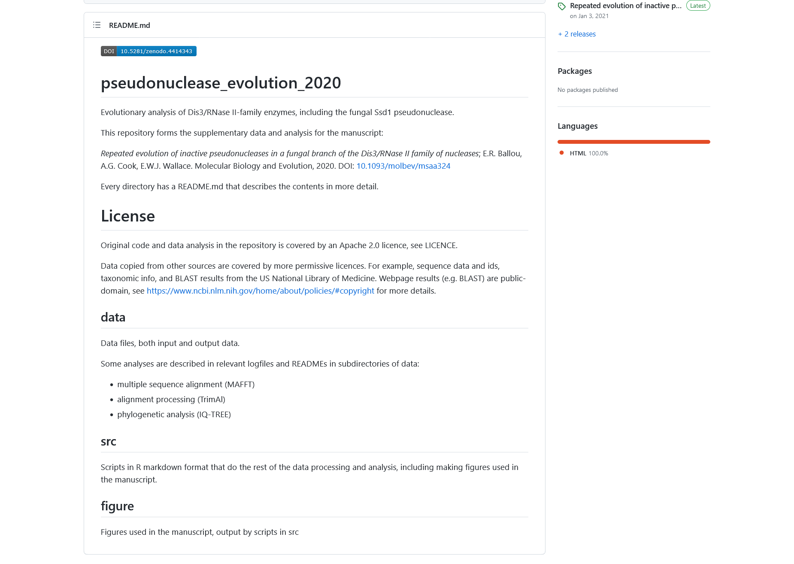

*The content of readme file before applying the changes from the change log entry above*

----
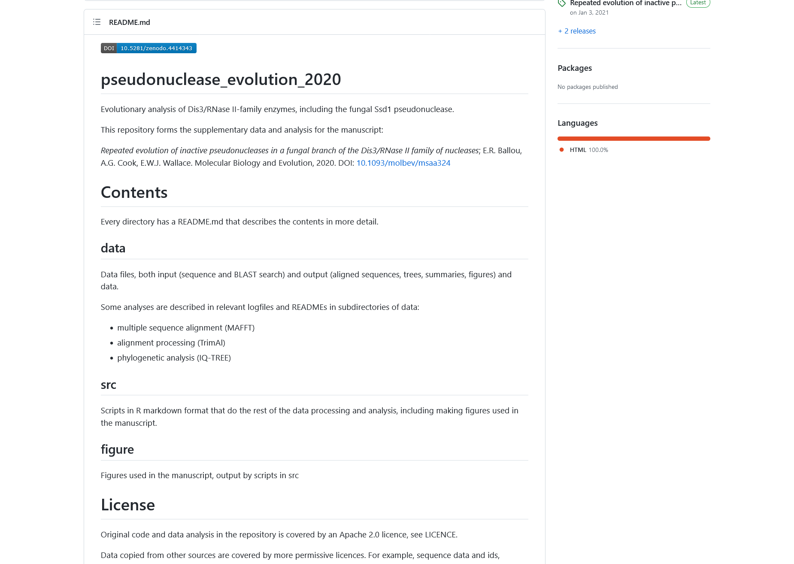

*The content of readme file after applying the changes from the change log entry above*

----
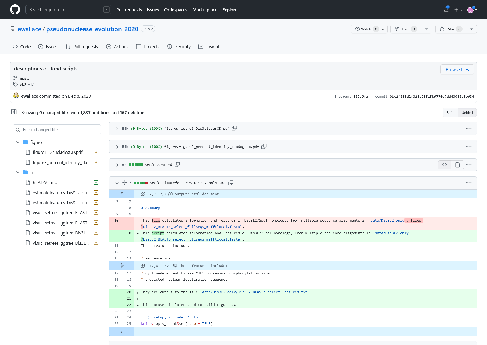

*Log Entry details for a multi-file change. Affected files are listed on the left, the nature of change can be previewed
in the middle panel*

----
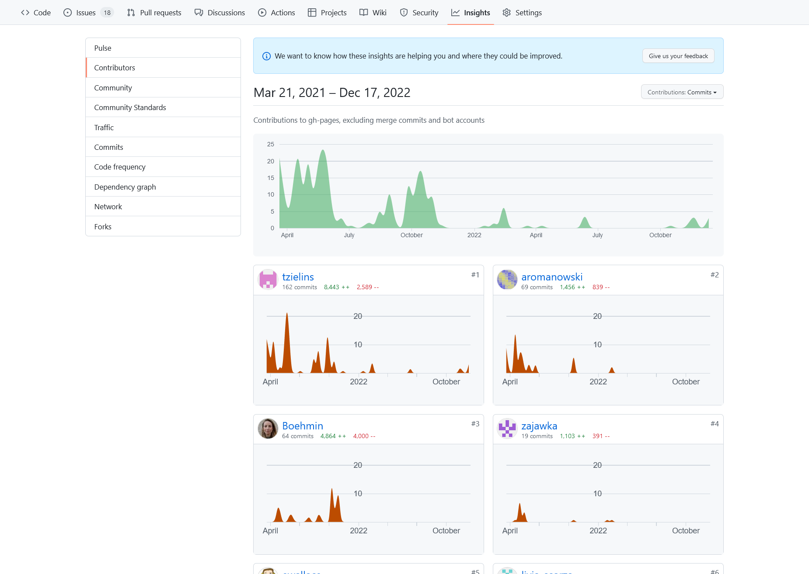

*View of the activity for the development of teaching materials for "FAIR in practice".  
There is visible summer drop of contributions due to the holiday seasons.
Then the are burst of activities just before and after of dealivering that workshop.*

----
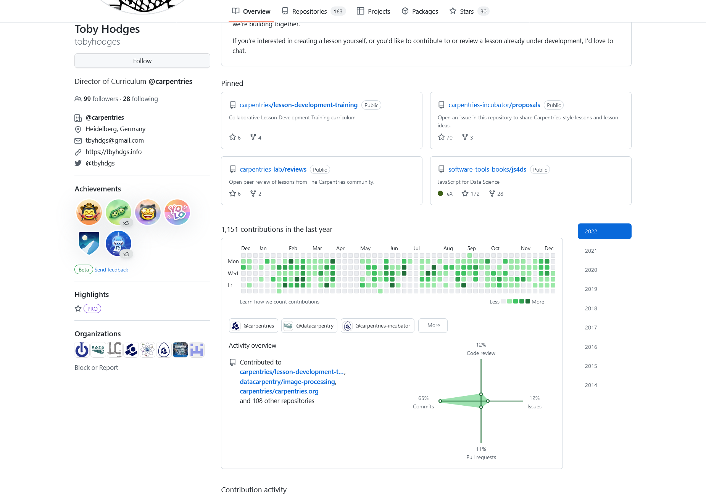

*GitHub page for one of the carpentries editor, show his involvement in multiple open projects*

## Benchling

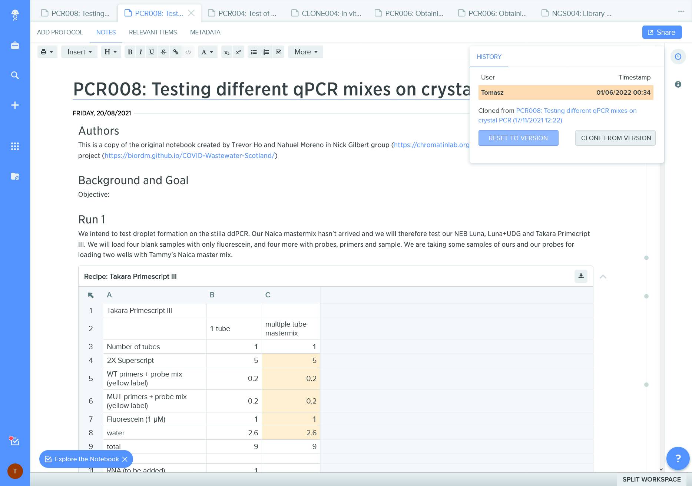

*ELN record with provenance information; it is a clone ie a copy of another record*

----
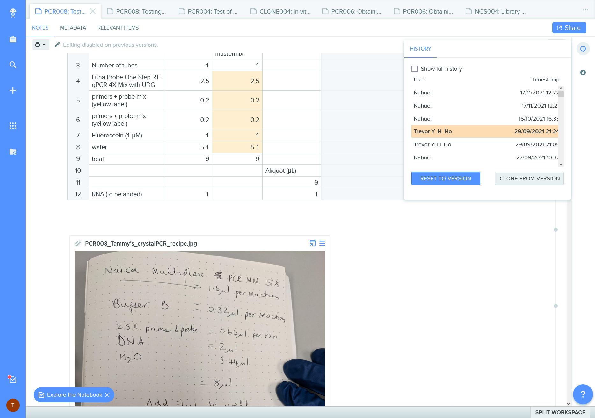

*Benchling change record documents authorship of edits and permits a quick "time travel" to the earlier versions.  
It misses the description message of the changes.*

----
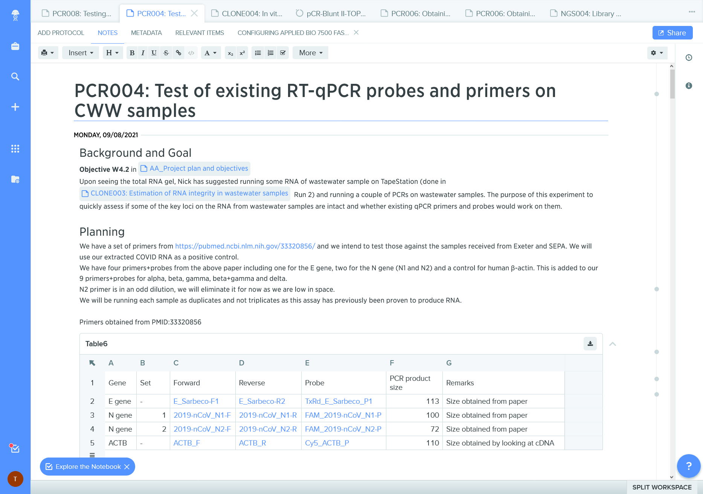

*ELN records can contain links to other documents / information systems*

----
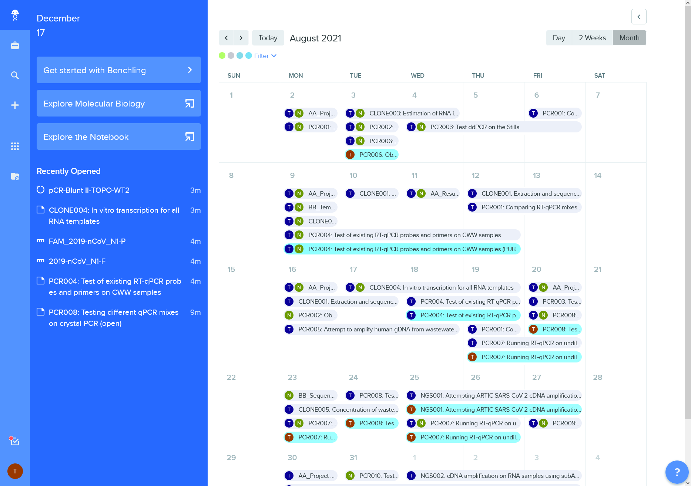

*Calendar view of lab activities*

----
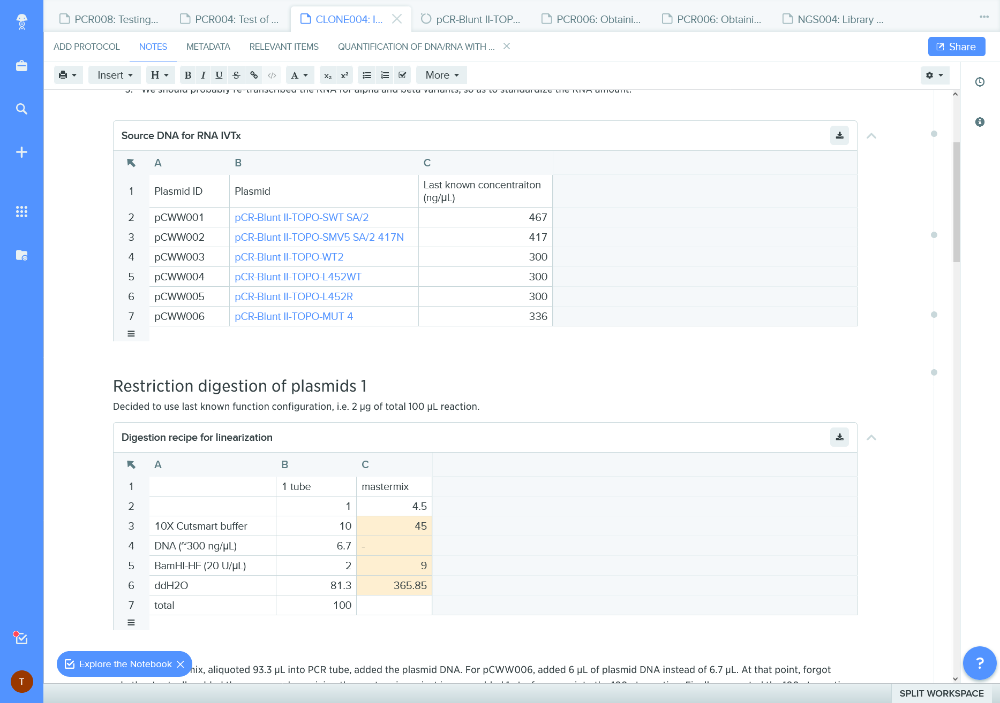

*References to iventory of biological materials*

----
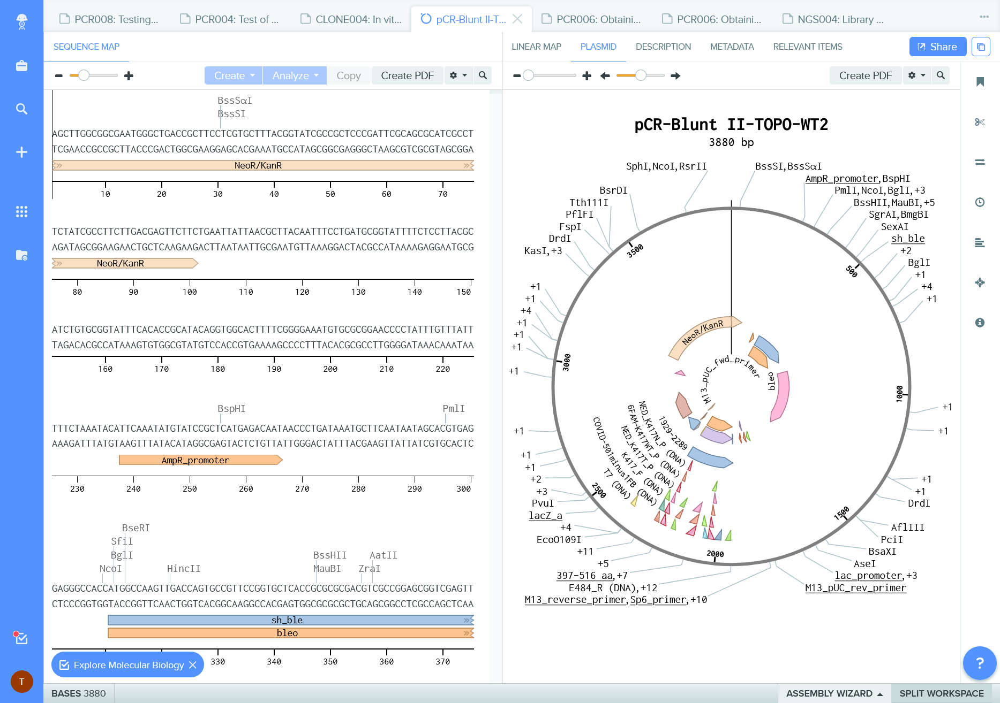

*Embeded tools and visualizations for molecular biology*

### More text will come :)


